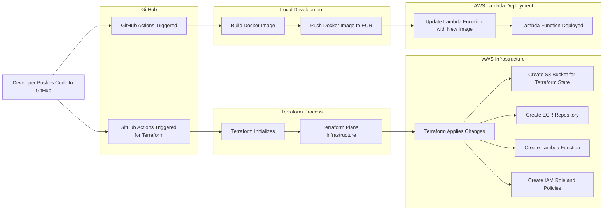

# AWS Lambda CI/CD and Terraform Deployment Template

A complete template for deploying Python code to AWS Lambda using a CI/CD pipeline. It includes everything you need to get started, from infrastructure setup with Terraform to containerizing your application with Docker. This template is designed to be a starting point for more complex and advanced code and deployments.

## Overview

This project demonstrates how to deploy a Python application as an AWS Lambda function using a fully automated CI/CD pipeline and manage the required infrastructure using Terraform. The key components include:

- **GitHub**: Version control and CI/CD automation using GitHub Actions.
- **Terraform**: Infrastructure as Code (IaC) to provision AWS resources.
- **AWS**: Services including Lambda, and ECR.
- **Docker**: Containerization of the Python application.

## Architecture

The system design emphasizes:

- **Replicability**: Ensuring the environment can be reproduced easily.
- **Automation**: Minimizing manual steps in the deployment process.
- **Everything as Code**: Managing infrastructure and pipelines using code for consistency and version control.
- **Self-Documentation**: Using code to document the system, making it easier to understand and maintain.

## Prerequisites

- AWS Account
- AWS CLI configured with appropriate permissions
- GitHub account

## Usage

After deploying, your Lambda function will be accessible via AWS console.

## Contributing

Contributions are welcome! Please fork this repository and submit pull requests with any improvements or bug fixes.
