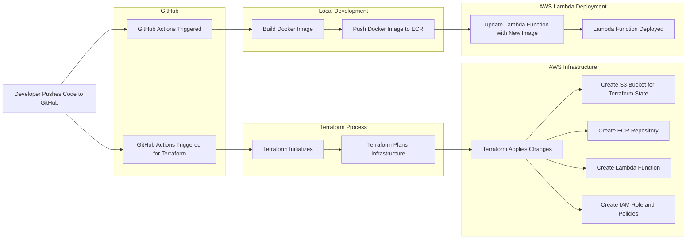

# Taking Your Code to Serverless Function An Overview

This article gives you a high-level overview of what you need to deploy your Python code to AWS Lambda with an automated CI/CD pipeline. We will look at each building block in more detail in later articles. This one provides a basic architecture of the whole system.

This repository demonstrates how to create a system that automates everything and reacts to changes in your code. The pipeline is capable of taking your code, building a Docker image from it, pushing it to a Docker repository, and deploying it to your serverless function. You can see it as a basic template for how these tasks are done. The complete code is shared in a public GitHub repository. In the repo, you can find everything needed to make this example run.

### Basic Architecture of the Solution

- **GitHub Repository**
  - Version control system
  - Automation for CI/CD

- **Terraform**
  - Infrastructure as Code tool

- **AWS**
  - Infrastructure

- **Python**
  - Simple code for our function

- **Docker**
  - Tool to build your container

### System Design

### Crucial Points in This System Design

- **Replicability**: Make sure the environment can be reproduced easily.
- **Automation**: Minimize manual steps in the deployment process.
- **Everything as Code**: Manage infrastructure and pipelines using code.
- **Describe the Whole System as Code**: Documentation through code.
- **Self-Documentation**: Using code to document the system, making it easier to understand and maintain.

### AWS Resources Needed

1. **Amazon Elastic Container Registry (ECR)**
    - **Repository**: To store your Docker images.
    - **Permissions**: Ensure you have the necessary permissions to push and pull images.

2. **AWS Lambda**
    - **Lambda Function**: To run your containerized application.
    - **Permissions**: An IAM role with the necessary permissions to access the ECR repository and execute the Lambda function.

3. **AWS Identity and Access Management (IAM)**
    - **IAM Role for Lambda**: This role should have permissions to retrieve images from ECR and execute the Lambda function.
        - Example policy: `AmazonEC2ContainerRegistryReadOnly`, `AWSLambdaBasicExecutionRole`.
    - **IAM User or Role for GitHub Actions**: This user or role should have permissions to push images to ECR and update the Lambda function.
        - Example policy: Custom policy to allow `ecr:PutImage`, `ecr:GetDownloadUrlForLayer`, `lambda:UpdateFunctionCode`.

This high-level overview shows you the basic architecture and essential components needed to make your Python code publicly accessible with AWS Lambda. I'll write more detailed articles on each building block.
